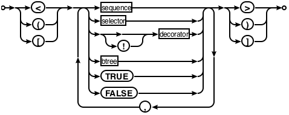

# Behavior Trees

Behavior Trees implement the entity-component system of the game, where a "component" is a behavior. Behavior tree is halfway between scripting and plug and play behavior.

`Behavior.Custom` -- for low-level unit behaviors (decorators with side effects)  
`Behavior.Library` -- for high-level unit behavior trees (automatic conversion from shorthand)

**Selector**: process children and bail with TRUE on first child return value of TRUE, else return FALSE  
**Sequence**: process children and bail with FALSE on first child return value of FALSE, else return TRUE.  
**Decorator**: process itself and return a bool, possibly with side effects.  

syntax diagram for the shorthand:  

* Decorator prefix naming standard:  
is___  = condition check  
try___ = attempt to set a condition based on another condition  
Task Decorators should always return true.

***

### notes on behavior tree shorthand

    () = selector
    <> = sequence
    [] = decorator
    !token = run the decorator but return with logically opposite result
    
    you don't actually need chained decorators, as sequences and inverts
    allow you to do the same thing
    
    decorator-filter1
     decorator-filter2
       decorator-filter3
         shootMachineGun
    
    is identical to
    <decorator-filter1,decorator-filter2,decorator-filter3,shootMachineGun>
    
### Example shorthands

moveAndBoundsCheck

    <
      [move],
      [loopAnimation],
      <
        [isOutsideWorld],
        [walkingOffMapCheck]
      >
    >
    
Infantry

    (
      [isReloading],
      <
        [isBerserking],
        [moveAndBoundsCheck]    
      >,
      <
        [foundTarget],
        [seeTarget],
        [setFacingTarget],
        [attack],
        [tryBerserking]
        [loopAnimation]
      >,
      <
        [setFacingTarget],
        [moveAndBoundsCheck]
      >
    )
    
    
APC

    (
      [isReloading],
      <
        [foundTarget],
        (
          <
            [!isVehicleFacingTarget],
            [loopAnimation]
          >,
          <
            [seeTarget],
            [attack]
          >
        )
      >,
      [moveAndBoundsCheck]
    )