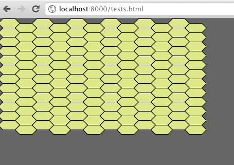
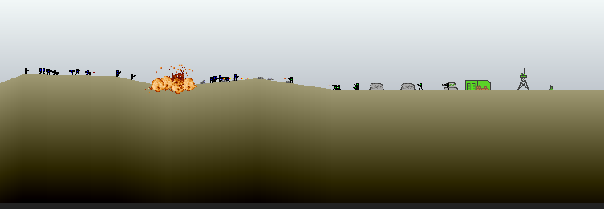
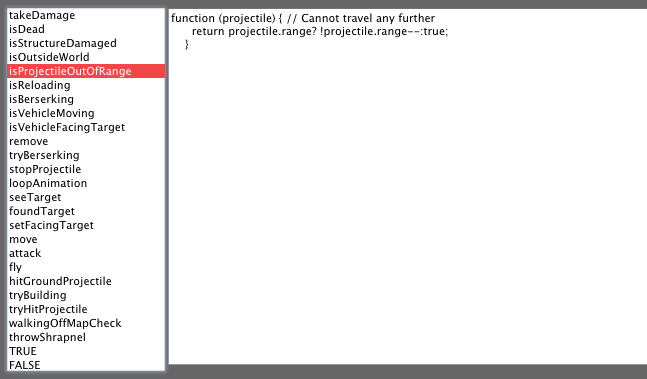
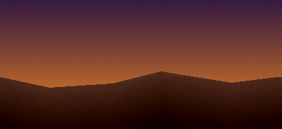
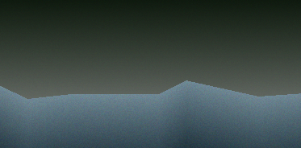
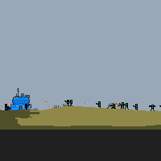
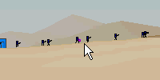
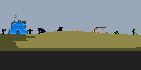

# Dev-Log

### June 11, 2012 -- continuing refactoring of code, campaign view
* most show-stopping regressions fixed
* game objects now using Class.extend
* campaign view initial work on mouse hex tile selection  

### May 20, 2012 -- re-organization of code and inheritance
* created the starting pieces for campaign view, we have hexes!  

* unifying game pieces to use inheritance more effectively, cutting down # of lines of code
* wrote a lot of plans onto paper, to be created as issues and fit into a roadmap later

### Feb 21, 2012 -- added MissileRack, tweak generation
* added some new structures: SmallMine, MissileRack, CommRelay
* gameplay dynamics of these new pieces is to be defined later
* remove CommCenter's panic attack, made HomingMissile explosions less insane
* general state of things: progressing well, battleview stuff coming together nicely:  

### Feb 17, 2012 -- AI fully moved into BTrees
* remaining files in entity_(whatever).js are merely stats and damage values
* all behavior has been component-ized
* begun work on a btree creation/editing tool  

### Jan 30, 2012 -- BG/FG generation
* wrote some rudimentary code to blend BG and terrain layers, generate heightmaps for the battle view
* procedurally generate peaks / troughs for terrain
* added some color deviations in drawing, to give it a bit of coarseness
* visual tests implemented in both  
 - 

### Jan 9, 2012 -- behavior trees, done
* finished moving logic from most battle-view entities into custom behavior library
* converted high level stuff into behavior trees composed of these behaviors

### before Dec 31,2011 -- more entity logic
* added vehicles and a few more behaviors for scaffold, pillbox and commcenter
* panic attacks by commcenter  

* construction of structures  

* commandeering empty buildings  
